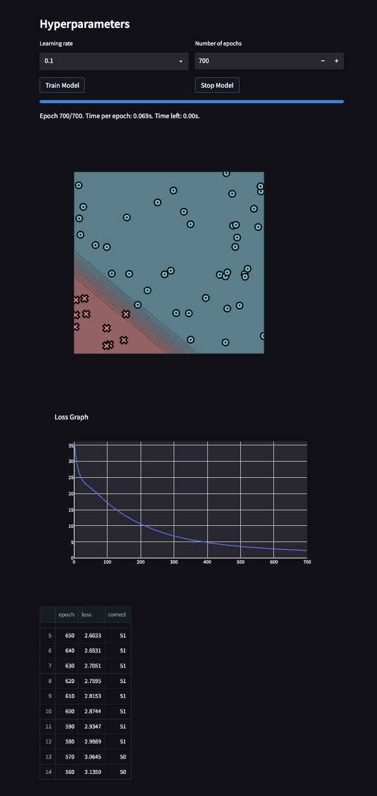

[](https://classroom.github.com/a/YFgwt0yY)
# MiniTorch Module 2


* Docs: https://minitorch.github.io/

* Overview: https://minitorch.github.io/module2/module2/

This assignment requires the following files from the previous assignments. You can get these by running

```bash
python sync_previous_module.py previous-module-dir current-module-dir
```

The files that will be synced are:

        minitorch/operators.py minitorch/module.py minitorch/autodiff.py minitorch/scalar.py minitorch/scalar_functions.py minitorch/module.py project/run_manual.py project/run_scalar.py project/datasets.py

# Task 2.5: Training

## Simple Dataset

__Visualization:__

50 points, 2 hidden layers, learning rate = 0.1

Time per epoch: 0.046s


__Output training log__

```
Epoch: 0/500, loss: 0, correct: 0
Epoch: 10/500, loss: 34.685980059640436, correct: 26
Epoch: 20/500, loss: 34.105860942979426, correct: 26
Epoch: 30/500, loss: 33.74252975965116, correct: 26
Epoch: 40/500, loss: 33.40259582634899, correct: 41
Epoch: 50/500, loss: 33.00469912550015, correct: 44
Epoch: 60/500, loss: 32.4979861545083, correct: 45
Epoch: 70/500, loss: 31.831542184408917, correct: 45
Epoch: 80/500, loss: 30.938691379311162, correct: 47
Epoch: 90/500, loss: 29.7274268070313, correct: 47
Epoch: 100/500, loss: 28.138036949759748, correct: 47
Epoch: 110/500, loss: 26.199988541408157, correct: 48
Epoch: 120/500, loss: 23.821219220976005, correct: 50
Epoch: 130/500, loss: 21.542541516326384, correct: 50
Epoch: 140/500, loss: 19.667601281380815, correct: 49
Epoch: 150/500, loss: 18.009264094973155, correct: 50
Epoch: 160/500, loss: 16.54888604063605, correct: 50
Epoch: 170/500, loss: 15.32171276880596, correct: 50
Epoch: 180/500, loss: 14.229387911451443, correct: 50
Epoch: 190/500, loss: 13.248839066510557, correct: 50
Epoch: 200/500, loss: 12.379732925327769, correct: 50
Epoch: 210/500, loss: 11.632196422600027, correct: 50
Epoch: 220/500, loss: 10.986004160964406, correct: 50
Epoch: 230/500, loss: 10.413362096281604, correct: 50
Epoch: 240/500, loss: 9.906081001033533, correct: 50
Epoch: 250/500, loss: 9.450925302696223, correct: 50
Epoch: 260/500, loss: 9.037176784845931, correct: 50
Epoch: 270/500, loss: 8.657494760072376, correct: 50
Epoch: 280/500, loss: 8.307820368283874, correct: 50
Epoch: 290/500, loss: 7.984605926078257, correct: 50
Epoch: 300/500, loss: 7.684898327673558, correct: 50
Epoch: 310/500, loss: 7.4061477288707005, correct: 50
Epoch: 320/500, loss: 7.146133103495648, correct: 50
Epoch: 330/500, loss: 6.9029556211013645, correct: 50
Epoch: 340/500, loss: 6.674952171500803, correct: 50
Epoch: 350/500, loss: 6.460687201353994, correct: 50
Epoch: 360/500, loss: 6.258933370913003, correct: 50
Epoch: 370/500, loss: 6.070035478123965, correct: 50
Epoch: 380/500, loss: 5.893451669031228, correct: 50
Epoch: 390/500, loss: 5.726376723853263, correct: 50
Epoch: 400/500, loss: 5.569414541781946, correct: 50
Epoch: 410/500, loss: 5.420882854924988, correct: 50
Epoch: 420/500, loss: 5.279920590404768, correct: 50
Epoch: 430/500, loss: 5.14586376722353, correct: 50
Epoch: 440/500, loss: 5.018131319661663, correct: 50
Epoch: 450/500, loss: 4.89621594833456, correct: 50
Epoch: 460/500, loss: 4.779665234354411, correct: 50
Epoch: 470/500, loss: 4.668083258698533, correct: 50
Epoch: 480/500, loss: 4.561119359568881, correct: 50
Epoch: 490/500, loss: 4.458462819596894, correct: 50
Epoch: 500/500, loss: 4.359833770943549, correct: 50
```

## Diag Dataset

__Visualization:__

51 points, 3 hidden layers, learning rate = 0.5

Time per epoch: 0.069s



__Output training log__

```
Epoch: 0/700, loss: 0, correct: 0
Epoch: 10/700, loss: 29.054541252732967, correct: 41
Epoch: 20/700, loss: 25.41366942930906, correct: 41
Epoch: 30/700, loss: 23.650233606474625, correct: 41
Epoch: 40/700, loss: 22.646236925420308, correct: 41
Epoch: 50/700, loss: 21.843504273020557, correct: 41
Epoch: 60/700, loss: 21.02871804562481, correct: 41
Epoch: 70/700, loss: 20.12098450191071, correct: 41
Epoch: 80/700, loss: 19.070155230336603, correct: 41
Epoch: 90/700, loss: 18.06031842260463, correct: 41
Epoch: 100/700, loss: 17.21721492726747, correct: 41
Epoch: 110/700, loss: 16.38276072284141, correct: 41
Epoch: 120/700, loss: 15.573941817661135, correct: 41
Epoch: 130/700, loss: 14.836843163548453, correct: 41
Epoch: 140/700, loss: 14.139142300737866, correct: 41
Epoch: 150/700, loss: 13.465265281028298, correct: 41
Epoch: 160/700, loss: 12.828807606069875, correct: 41
Epoch: 170/700, loss: 12.23000954339024, correct: 41
Epoch: 180/700, loss: 11.672045680017328, correct: 41
Epoch: 190/700, loss: 11.138271353919091, correct: 41
Epoch: 200/700, loss: 10.642807379028676, correct: 41
Epoch: 210/700, loss: 10.17414023580343, correct: 41
Epoch: 220/700, loss: 9.727120891991323, correct: 48
Epoch: 230/700, loss: 9.29868556057231, correct: 49
Epoch: 240/700, loss: 8.889134994564069, correct: 49
Epoch: 250/700, loss: 8.501194791589922, correct: 49
Epoch: 260/700, loss: 8.142429407717133, correct: 49
Epoch: 270/700, loss: 7.803102125835061, correct: 50
Epoch: 280/700, loss: 7.486421984804726, correct: 50
Epoch: 290/700, loss: 7.191989204617195, correct: 50
Epoch: 300/700, loss: 6.9145849277858655, correct: 50
Epoch: 310/700, loss: 6.653790570229663, correct: 50
Epoch: 320/700, loss: 6.4087865886825925, correct: 50
Epoch: 330/700, loss: 6.176904717934138, correct: 50
Epoch: 340/700, loss: 5.957222905351255, correct: 50
Epoch: 350/700, loss: 5.74902437509722, correct: 50
Epoch: 360/700, loss: 5.5516239334023165, correct: 50
Epoch: 370/700, loss: 5.36438739249776, correct: 50
Epoch: 380/700, loss: 5.186717063248405, correct: 50
Epoch: 390/700, loss: 5.018049867453308, correct: 50
Epoch: 400/700, loss: 4.85785555034795, correct: 50
Epoch: 410/700, loss: 4.705634990686404, correct: 50
Epoch: 420/700, loss: 4.560918600600191, correct: 50
Epoch: 430/700, loss: 4.423264804814815, correct: 50
Epoch: 440/700, loss: 4.292479702453678, correct: 50
Epoch: 450/700, loss: 4.167948020127423, correct: 50
Epoch: 460/700, loss: 4.049284890337663, correct: 50
Epoch: 470/700, loss: 3.9361476166671814, correct: 50
Epoch: 480/700, loss: 3.8282152051323175, correct: 50
Epoch: 490/700, loss: 3.7251943085232777, correct: 50
Epoch: 500/700, loss: 3.6280191277099294, correct: 50
Epoch: 510/700, loss: 3.5346191525381383, correct: 50
Epoch: 520/700, loss: 3.4464269892085007, correct: 50
Epoch: 530/700, loss: 3.363215443260349, correct: 50
Epoch: 540/700, loss: 3.283044262441906, correct: 50
Epoch: 550/700, loss: 3.2066106243244765, correct: 50
Epoch: 560/700, loss: 3.134990587135336, correct: 50
Epoch: 570/700, loss: 3.0645027790254264, correct: 50
Epoch: 580/700, loss: 2.9988731846102183, correct: 51
Epoch: 590/700, loss: 2.934720651210375, correct: 51
Epoch: 600/700, loss: 2.8743652032890603, correct: 51
Epoch: 610/700, loss: 2.8153351954219366, correct: 51
Epoch: 620/700, loss: 2.7595151482706055, correct: 51
Epoch: 630/700, loss: 2.7051214780667356, correct: 51
Epoch: 640/700, loss: 2.653119379918977, correct: 51
Epoch: 650/700, loss: 2.603348825652025, correct: 51
Epoch: 660/700, loss: 2.555344844527647, correct: 51
Epoch: 670/700, loss: 2.509000972345581, correct: 51
Epoch: 680/700, loss: 2.464228766688062, correct: 51
Epoch: 690/700, loss: 2.420967230999194, correct: 51
Epoch: 700/700, loss: 2.3791366431391268, correct: 51
```

## Split Dataset

__Visualization:__

55 points, 6 hidden layers, learning rate = 0.5

Time per epoch: 0.166s


__Output training log__

```
Epoch: 0/500, loss: 0, correct: 0
Epoch: 10/500, loss: 35.20251797357842, correct: 36
Epoch: 20/500, loss: 33.72774775798991, correct: 36
Epoch: 30/500, loss: 31.495774387247078, correct: 39
Epoch: 40/500, loss: 30.879950605122005, correct: 34
Epoch: 50/500, loss: 27.56561838695723, correct: 36
Epoch: 60/500, loss: 26.39739399397584, correct: 43
Epoch: 70/500, loss: 24.312077830192916, correct: 42
Epoch: 80/500, loss: 21.791874456451414, correct: 44
Epoch: 90/500, loss: 14.11186070603057, correct: 52
Epoch: 100/500, loss: 14.3191550560948, correct: 52
Epoch: 110/500, loss: 20.984431873865205, correct: 46
Epoch: 120/500, loss: 22.740218820498193, correct: 41
Epoch: 130/500, loss: 18.498847113153783, correct: 45
Epoch: 140/500, loss: 17.261441417086363, correct: 46
Epoch: 150/500, loss: 15.392109561370942, correct: 47
Epoch: 160/500, loss: 15.375527843972135, correct: 47
Epoch: 170/500, loss: 14.365235817511648, correct: 49
Epoch: 180/500, loss: 12.151569929516755, correct: 50
Epoch: 190/500, loss: 10.54856100713949, correct: 53
Epoch: 200/500, loss: 9.128571970575802, correct: 53
Epoch: 210/500, loss: 7.80553960185719, correct: 53
Epoch: 220/500, loss: 8.590878823489286, correct: 53
Epoch: 230/500, loss: 43.61629008025132, correct: 39
Epoch: 240/500, loss: 4.171128636164429, correct: 55
Epoch: 250/500, loss: 3.6492914671623726, correct: 55
Epoch: 260/500, loss: 3.344930039547026, correct: 55
Epoch: 270/500, loss: 4.028708695141549, correct: 53
Epoch: 280/500, loss: 9.111087851657919, correct: 53
Epoch: 290/500, loss: 3.200400145257362, correct: 54
Epoch: 300/500, loss: 2.8238578695213064, correct: 55
Epoch: 310/500, loss: 2.6029925660124253, correct: 55
Epoch: 320/500, loss: 2.457651047819757, correct: 55
Epoch: 330/500, loss: 2.7241080140086127, correct: 53
Epoch: 340/500, loss: 15.131173556904349, correct: 49
Epoch: 350/500, loss: 7.715689679310049, correct: 52
Epoch: 360/500, loss: 2.5561308521047645, correct: 55
Epoch: 370/500, loss: 2.3079348851265413, correct: 55
Epoch: 380/500, loss: 2.136080468249702, correct: 55
Epoch: 390/500, loss: 1.9956597923598884, correct: 55
Epoch: 400/500, loss: 1.874836762620859, correct: 55
Epoch: 410/500, loss: 1.7682111014659003, correct: 55
Epoch: 420/500, loss: 1.6733398560001334, correct: 55
Epoch: 430/500, loss: 1.6020213657730236, correct: 55
Epoch: 440/500, loss: 2.2383530691916143, correct: 53
Epoch: 450/500, loss: 24.463976768846248, correct: 44
Epoch: 460/500, loss: 7.52116592500863, correct: 52
Epoch: 470/500, loss: 2.1842198678253992, correct: 55
Epoch: 480/500, loss: 1.9252069204428304, correct: 55
Epoch: 490/500, loss: 1.7597459909542685, correct: 55
Epoch: 500/500, loss: 1.635761554760355, correct: 55
```

## Xor Dataset

__Visualization:__

50 points, 16 hidden layers, learning rate = 0.1

Time per epoch: 0.700s


__Output training log__

```
Epoch: 0/800, loss: 0, correct: 0
Epoch: 10/800, loss: 32.55623628261388, correct: 31
Epoch: 20/800, loss: 31.867663562171376, correct: 31
Epoch: 30/800, loss: 31.30938419428335, correct: 34
Epoch: 40/800, loss: 30.83033970441976, correct: 35
Epoch: 50/800, loss: 30.339771839552622, correct: 35
Epoch: 60/800, loss: 29.863207807728127, correct: 35
Epoch: 70/800, loss: 29.389901352814135, correct: 35
Epoch: 80/800, loss: 28.88251874401826, correct: 36
Epoch: 90/800, loss: 28.33438382422058, correct: 37
Epoch: 100/800, loss: 27.728458106068146, correct: 38
Epoch: 110/800, loss: 27.07396131890403, correct: 37
Epoch: 120/800, loss: 26.3659024820081, correct: 38
Epoch: 130/800, loss: 25.59419457962014, correct: 38
Epoch: 140/800, loss: 24.70764110315516, correct: 38
Epoch: 150/800, loss: 23.749836074036626, correct: 39
Epoch: 160/800, loss: 22.75478317760549, correct: 40
Epoch: 170/800, loss: 21.737587308562514, correct: 42
Epoch: 180/800, loss: 20.7266298429387, correct: 42
Epoch: 190/800, loss: 19.708942936747203, correct: 43
Epoch: 200/800, loss: 18.789309637085047, correct: 45
Epoch: 210/800, loss: 17.927558768226525, correct: 45
Epoch: 220/800, loss: 17.101869017233344, correct: 45
Epoch: 230/800, loss: 16.330316221732573, correct: 46
Epoch: 240/800, loss: 15.608167182409266, correct: 46
Epoch: 250/800, loss: 14.923472812207944, correct: 46
Epoch: 260/800, loss: 14.280274846301593, correct: 47
Epoch: 270/800, loss: 13.679153407175153, correct: 47
Epoch: 280/800, loss: 13.12515128472474, correct: 48
Epoch: 290/800, loss: 12.607776918990163, correct: 48
Epoch: 300/800, loss: 12.133295955569999, correct: 48
Epoch: 310/800, loss: 11.692619486349088, correct: 48
Epoch: 320/800, loss: 11.290926941071833, correct: 48
Epoch: 330/800, loss: 10.92041347200203, correct: 48
Epoch: 340/800, loss: 10.573870944917271, correct: 48
Epoch: 350/800, loss: 10.25107628073137, correct: 48
Epoch: 360/800, loss: 9.948873095267096, correct: 48
Epoch: 370/800, loss: 9.666159016630159, correct: 48
Epoch: 380/800, loss: 9.399023537525931, correct: 50
Epoch: 390/800, loss: 9.149240545288981, correct: 50
Epoch: 400/800, loss: 8.913992271826892, correct: 50
Epoch: 410/800, loss: 8.6928960552541, correct: 50
Epoch: 420/800, loss: 8.482866321380634, correct: 50
Epoch: 430/800, loss: 8.28636029378717, correct: 50
Epoch: 440/800, loss: 8.09637084233312, correct: 50
Epoch: 450/800, loss: 7.916005770900617, correct: 50
Epoch: 460/800, loss: 7.7508739134067, correct: 50
Epoch: 470/800, loss: 7.583619085980722, correct: 50
Epoch: 480/800, loss: 7.424597647727295, correct: 50
Epoch: 490/800, loss: 7.275242760396014, correct: 50
Epoch: 500/800, loss: 7.13021884224856, correct: 50
Epoch: 510/800, loss: 6.991450902488097, correct: 50
Epoch: 520/800, loss: 6.854480924797442, correct: 50
Epoch: 530/800, loss: 6.726413533234776, correct: 50
Epoch: 540/800, loss: 6.606623402470744, correct: 50
Epoch: 550/800, loss: 6.480936993208796, correct: 50
Epoch: 560/800, loss: 6.365129141153974, correct: 50
Epoch: 570/800, loss: 6.2533910157582, correct: 50
Epoch: 580/800, loss: 6.146701152820523, correct: 50
Epoch: 590/800, loss: 6.0381080906789375, correct: 50
Epoch: 600/800, loss: 5.938147731863983, correct: 50
Epoch: 610/800, loss: 5.838189734098852, correct: 50
Epoch: 620/800, loss: 5.742352618453654, correct: 50
Epoch: 630/800, loss: 5.652496992666385, correct: 50
Epoch: 640/800, loss: 5.561965241284066, correct: 50
Epoch: 650/800, loss: 5.476831169102375, correct: 50
Epoch: 660/800, loss: 5.3913849264751015, correct: 50
Epoch: 670/800, loss: 5.309984200162603, correct: 50
Epoch: 680/800, loss: 5.231540719880111, correct: 50
Epoch: 690/800, loss: 5.1553713364821885, correct: 50
Epoch: 700/800, loss: 5.080644497794557, correct: 50
Epoch: 710/800, loss: 5.010416827471434, correct: 50
Epoch: 720/800, loss: 4.939251239579784, correct: 50
Epoch: 730/800, loss: 4.87131303599022, correct: 50
Epoch: 740/800, loss: 4.8054708054889685, correct: 50
Epoch: 750/800, loss: 4.74050532949167, correct: 50
Epoch: 760/800, loss: 4.677360209793716, correct: 50
Epoch: 770/800, loss: 4.615771563068775, correct: 50
Epoch: 780/800, loss: 4.555667804862497, correct: 50
Epoch: 790/800, loss: 4.496808410077174, correct: 50
Epoch: 800/800, loss: 4.43891534294573, correct: 50
```